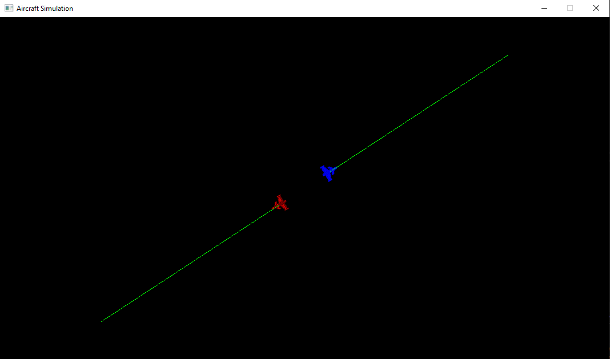

# Aircraft Simulation Project

This project simulates the behavior of aircraft in a 2D space, utilizing SDL for graphical rendering and Python for behavior scripting via `pybind11`. The simulation consists of aircraft that move across the screen in a linear pattern, with updates driven by Python-controlled behavior. The aircraft are rendered and controlled in real-time within an SDL window, and their positions are updated every frame.

## Project Overview

### Key Components:
- **Aircraft Simulation**: The core of the project, managing aircraft objects, rendering the graphical window, and updating the positions of the aircraft.
- **Python Integration**: The simulation interacts with Python to control the behavior of aircraft via an external Python script. This script defines behavior such as moving aircraft in a linear pattern or making decisions based on their current positions.
- **SDL**: SDL (Simple DirectMedia Layer) is used for rendering the simulation's graphics and handling window events (e.g., quitting the simulation).
- **Multithreading**: The simulation runs in a separate thread, allowing the application to update the simulation and handle rendering without blocking other tasks.

## Features

- **Aircraft Movement**: Aircraft are moved in a linear pattern with small incremental steps. When reaching the edge of the window, they change direction.
- **Python-Controlled Behavior**: The aircraft's movement is managed by Python scripts via `pybind11`, allowing easy modification and extension of aircraft behavior.
- **Boundary Detection and Direction Change**: Aircraft detect window boundaries (left, right, top, bottom), and upon hitting these boundaries, they change direction and move in a different axis (horizontal to vertical, and vice versa).

## Screenshot

Here is a screenshot of the simulation's render screen:





## Setup

### Prerequisites:
- **C++ Compiler**: Ensure you have a C++ compiler that supports C++11 or later.
- **SDL2**: The project depends on SDL2 for rendering the graphics. You must have SDL2 installed on your system.
- **Python**: Python (preferably version 3.12) is required for running the behavior script.
- **pybind11**: Used for binding C++ and Python, allowing interaction between the simulation and the Python script.

### Installing Dependencies

1. **Install SDL2**:
    
    - On Windows, you can download SDL2 ```SDL2-devel-2.30.10-VC.zip``` from the [SDL github link](https://github.com/libsdl-org/SDL/releases/download/release-2.30.10/SDL2-devel-2.30.10-VC.zip)
   
2. **Install Python and pybind11**:
   - Ensure Python 3.12 is installed.
   - Install pybind11 via pip:

     ```bash
     pip install pybind11
     ```

### Using `setup.py`
- Setup.py file is present in project
- With `setup.py`, you can build and install the project using the following commands:

1. **Install the project**:
   Navigate to the project where setup.py is present and run:

   ```bash
   python setup.py build_ext --inplace
   ```

### **Run**
- Application in VS2022 and set configuration to ```release 64x``` 